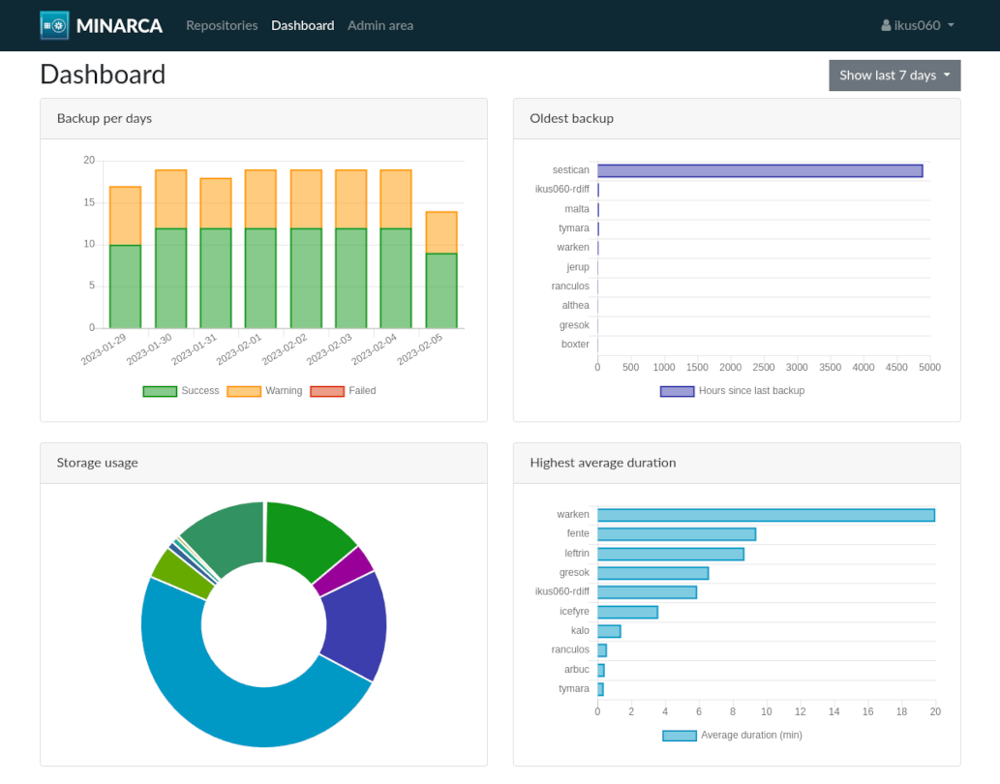
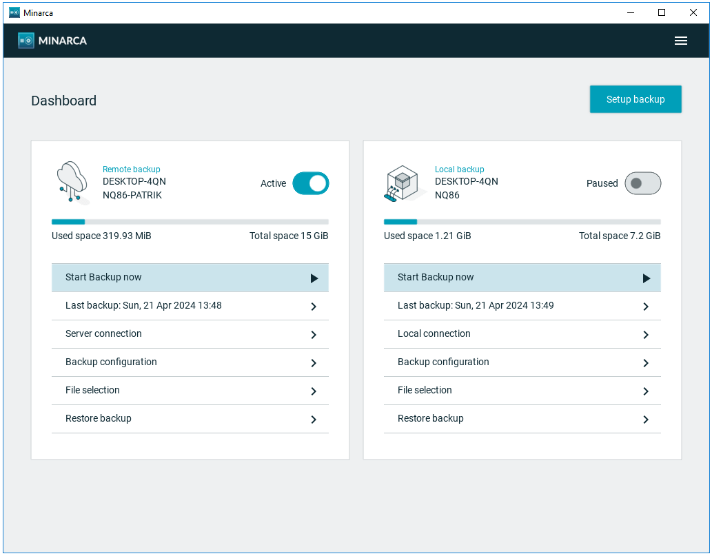
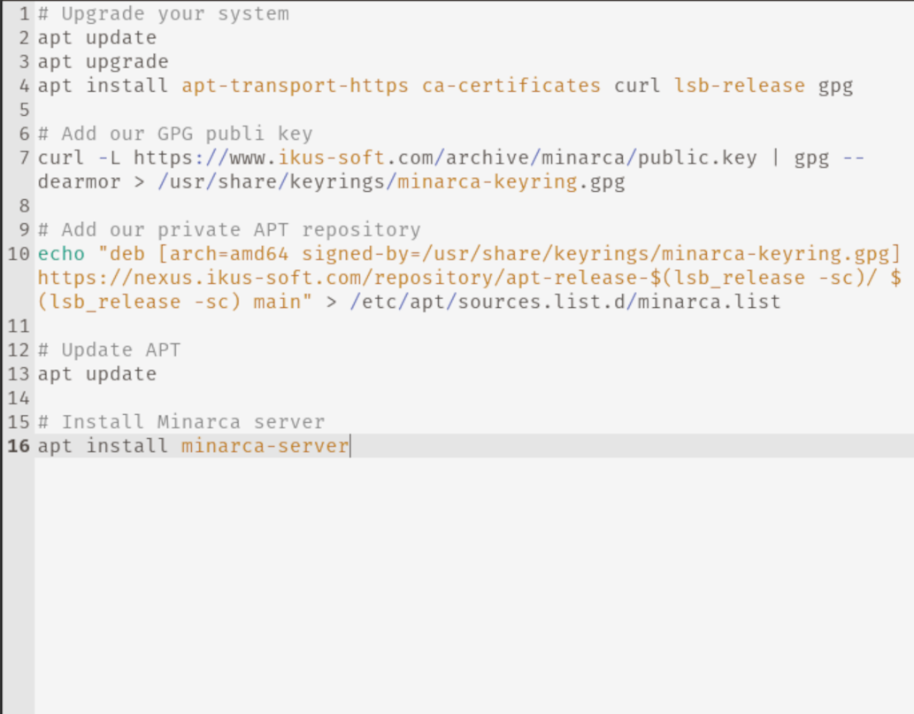
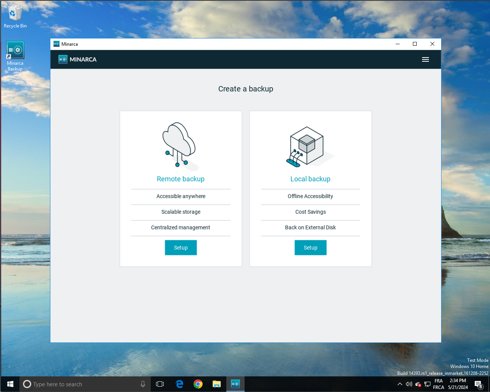
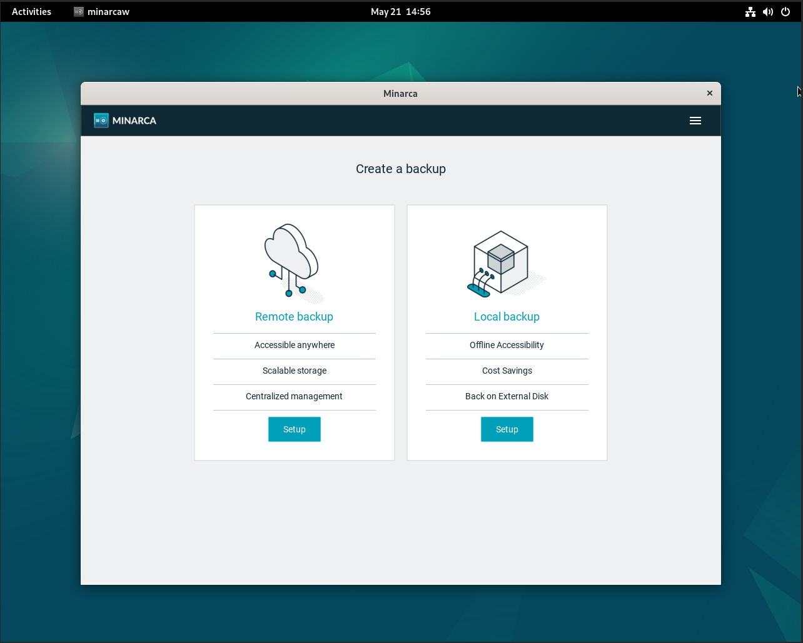
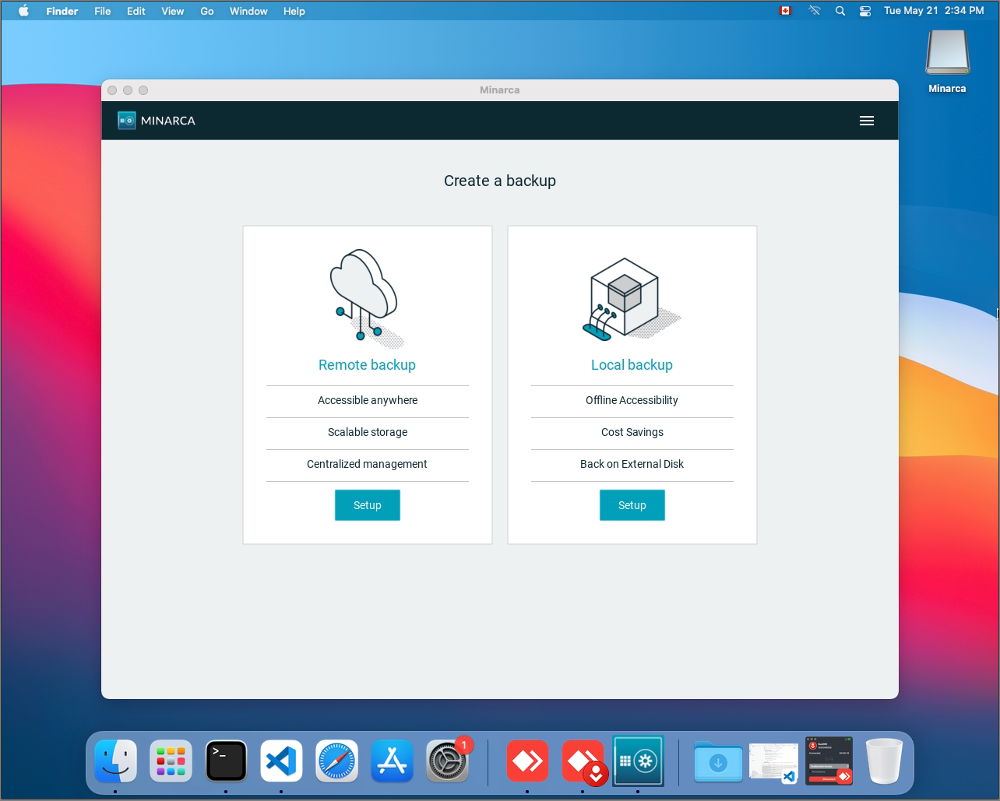

<p align="center">
  <strong>
    <a href="https://minarca.org">website</a>
    •
    <a href="https://www.ikus-soft.com/en/minarca/doc">docs</a>
    •
    <a href="https://minarca.org/contactus">newsletter</a>
  </strong>
</p>

<p align="center">
  <a href="LICENSE"></a>
  <a href="https://gitlab.com/ikus-soft/minarca/pipelines"></a>
  <a href="https://sonar.ikus-soft.com/dashboard?id=minarca"></a>
  <a href="https://sonar.ikus-soft.com/dashboard?id=minarca"></a>
</p>

<h1 align="center">
  Welcome to Minarca Backup Software!
</h1>

Minarca is a **free and open-source** backup software providing end-to-end integration to put you in control of your backup strategy. This **Self-Hosted** software may suit the needs of service providers or small business.

**Simple** to install, to configure and to manage, Minarca will not waste your time. Minarca makes user data easily accessible by providing a rich **web interface** to recover the files.

**Minarca client** may be used to simplify the integration of new computers running **Windows or Linux Debian**. It's user interface and command line interface allow simple usage for **desktop users or headless servers**. Minarca also keep interoperability with legacy installation of [rdiff-backup](https://rdiff-backup.net/).

Based on [rdiffweb](https://rdiffweb.org/), **Minarca Server** may be used to browse, **restore your data easily** with a convenient web interface accessible from everywhere.

## Features

| Powerful web interface | Backup to multiple destination | Self Hosted |
|---|---|---|
|  |  |  |


| Windows Agent | Linux Agent | MacOS Agent |
|---|---|---|
|  |  |  |


## Getting started

Check how Minarca is working without installing the server. We have setup a testing environment for you. You may login to <https://test.minarca.net/> using the default username / password: admin / admin123

Then start a backup in few minutes by installing minarca client for [Linux/Debian](https://nexus.ikus-soft.com/repository/archive/minarca/4.5.0/doc/minarca-client.html#installation-on-ubuntu-or-debian), [Windows](https://www.ikus-soft.com/archive/minarca/minarca-client_latest.exe) or [MacOS](https://www.ikus-soft.com/archive/minarca/minarca-client-latest.dmg).

## Download & Install

[Minarca Agent Installation steps](https://www.ikus-soft.com/archive/minarca/doc/minarca-client.html#installation)

[Minarca Server Installation steps](https://www.ikus-soft.com/archive/minarca/doc/installation.html)

## Pre-releases

We provide the ability to easily test future versions without having to compiling from source.

**Minarca Agent** can be downloaded from our archive: <https://www.ikus-soft.com/archive/minarca/>

**Minarca Server** can be install using our APT Dev repository:

```sh
curl -L https://www.ikus-soft.com/archive/minarca/public.key | gpg --dearmor > /usr/share/keyrings/minarca-keyring.gpg
echo "deb [arch=amd64 signed-by=/usr/share/keyrings/minarca-keyring.gpg] https://nexus.ikus-soft.com/repository/apt-dev-$(lsb_release -sc)/ $(lsb_release -sc) main" > /etc/apt/sources.list.d/minarca.list
apt update
apt install minarca-server
```

## Newsletter

Subscribing to our newsletter is an effective way to stay up-to-date on the latest news about Minarca.
By signing up for, you will receive regular updates and notifications about new features, updates, and releases related to Minarca.

[Minarca Newsletter](https://minarca.org/contactus).

## Documentation

Want to know more about Minarca and learn it thoroughly? Read our complete documentation.

[Minarca Documentation](https://www.ikus-soft.com/archive/minarca/doc/).

## Contribution

Thank you for considering contributing to Minarca Data Backup! There are several ways you can contribute to the project:

* **Report bugs:** If you find any issues with the software, please let us know by opening a new issue on our [Gitlab repository](https://gitlab.com/ikus-soft/minarca/-/issues). Be sure to include as much detail as possible, such as the steps to reproduce the bug and any error messages you receive.

* **Provide translations:** We are always looking to improve the accessibility of our software by supporting multiple languages. If you are fluent in a language that is not currently supported, we would greatly appreciate your help in translating the software.

* **Support more architectures:** We are looking to expand our support to more architectures, such as ARM for Raspberry Pi devices. If you have experience with these platforms and are interested in helping, please reach out to us.

* **Support for NAS technology:** We are targeting NAS devices as an easy deployment option for the Minarca Central server such as TrueSCALE. If you have experience with these devices and would like to help us with development, please let us know.

* **Provide RPM packages:** We currently do not have support for RedHat Linux distributions. If you have experience with building RPM packages and are interested in helping us support this distribution, please reach out to us.

We welcome all contributions to the project and appreciate any help you can provide.

## Professional support

Professional support for Minarca Data Backup is available by [contacting IKUS Soft](https://minarca.org/contactus).

## Support Us Through Github Sponsorship

We are passionate about developing and maintaining this open-source project to make it better with each update. Your support can help us continue our efforts and enhance the project for the entire community. By becoming a Github Sponsor, you directly contribute to the project's sustainability and growth.

[Becoming a Sponsor](https://github.com/sponsors/ikus060)

# About Minarca

Minarca Server is written in Python and is released as open source project under the
GNU AFFERO GENERAL PUBLIC LICENSE (AGPLv3). All source code and documentation are
Copyright IKUS Software inc. <support@ikus-soft.com>

Minarca Server is actively developed by [IKUS Software inc.](https://ikus-soft.com)
since April 2015.

The Minarca Server source code is hosted on [Gitlab](https://gitlab.com/ikus-soft/minarca)
and mirrored to [Github](https://github.com/ikus060/minarca).

The Minarca website is <https://minarca.org/>.

# Changelog

## Next Beta release

* Minarca Agent
  * Add exclude pattern for Google Drive temporary files

## 6.0.0b3

* Minarca Agent
  * Add backup identifier to `minarca status` command line output
  * Uppgrade to rdiff-backup v2.2.6
  * Include rdiff-backup patch to improve regression speed
  * Fix support for setuptools >= 70
  * Upgrade to latest KivyMD version
  * Raise notification if local backup is too old
  * Implement retention period for local backup
  * Disable retention period setting if user lacks permission to modify it
* Minarca Server
  * Upgrade rdiffweb to v2.9.1
* Docs:
  * Add details regard the path to help troubleshooting

## 6.0.0b2 (2024-04-26)

* Minarca Agent
  * Support Kivy inspector in debug mode (enabled using CTRL + E)
  * Fix display of disk usage

## 6.0.0b1 (2024-04-22)

* Minarca Agent
  * Support multiple backup source and target
  * Redesign interface using Kivy
  * Support Full & Partial restor
* Upgrade rdiffweb version v2.9.0
* Support `$minarcaid$` authentication for Minarca Agent.

## 5.0.5 (2024-04-16)

* Add a fix to enable long file path on Windows OS by default

## 5.0.4 (2024-04-07)

* Fix compatibility issue with backupninja #237

## 5.0.3 (2024-02-19)

* Upgrade rdiffweb to version 2.8.8
  * Fix display of settings pages for user with role "user" #235

## 5.0.2 (2024-01-08)

* Upgrade rdiffweb to version 2.8.8
  * Fix usage of `session-idle-timeout` in config file
  * Adjust the session idle and absolute timeouts to 10 and 30 minutes, respectively.
  * Fix date calculation when generating report in January 

## 5.0.1 (2023-11-24)

* Fix broken link to <https://www.ikus-soft.com> in documentation
* Add German translation - credit to [Michael Nitzsche](https://github.com/einzelfabrik)
* Upgrade rdiffweb to version 2.8.6

## 5.0.0 (2023-10-10)

* Upgrade rdiffweb to version 2.8.5
* Replace URL used for latest version check to avoid redirection
* Log original SSH Command on server side for improved visibility
* Use rdiff-backup v2.2.6 in minarca-client #194
* Keep backward compatibility with previous rdiff-backup version
* Use new rdiff-backup command line format to avoid WARNING in logs
* Apply additional patch to rdiff-backup for better windows support
* Add support for version 1.2.8, 2.0.x and 2.2.x #194
* Upgrade to Python version 3.10 on Windows #190
* Improve error handling arround rdiff-backup execution #203
* Improve error reporting in user interface
* Add missing `libxcb1` dependencies
* Add command line and graphical interface for full restore #213
* Inhebit should be working on Linux, Macos and Windows to prevent computer going to sleep during backup
* Allow user to pause backup for 24 hours to prevent backup execution, useful when you are in a remote location with slow bandwidth
* Add support for Ubuntu Lunar, Ubuntu Mantic
* Fix include/exclude pattern ordering to support exclusion with wildcard e.g.: `**/Backuo of*`
* Remove Ubuntu Kinetic support (22.10)

## 4.5.2 (2023-07-05)

* Avoid backup crash caused by log file rotation on Windows #212

## 4.5.1 (2023-07-03)

* Avoid backup crash for multi-disk on Windows #211

## 4.5.0 (2023-04-20)

* Upgrade Rdiffweb to v2.7.0
  * Fix MFA verification code email's subjet #270
  * Add translation for footer not in email layout
  * Provide a Monthly, Weekly or Daily repport for user #71
  * Send email to administrator when a new version is available #266

## 4.4.1 (2023-03-22)

* Add back support for Debian Bookworm #196
* Fix lookup of `rdiff-backup` executable

## 4.4.0 (2023-03-15)

* Upgrade Rdiffweb to v2.6.0
  * Review the application layout to use Fluid container to use all the space available on the screen
  * Rename status view to Dashboard
  * Display more useful data in Dashboard view: Backups per days, Oldest backup, Storage Usage, Average duration, Least Active, Most active
  * Fix deletion confirmation of repositories within subdirectory rdiffweb#250
  * Properly clean-up plain text email from HTML tags
  * Send notification for inactive backup based on statistics
  * Send notification using a new template following the web interface branding
  * Send notification to user when repository get added or removed
  * Send all notification to an optional "catch-all" email address configured using `--email-catch-all` option #258
  * Redistribute logos in PNG format for better compatibility
  * Disable error page logs for 4xx errors
  * Add username and IP address to logs only for HTTP Request
  * Fix LDAP integration to support non-list attributes - credit to [Shane Robinson](https://gitlab.com/shanesq)
  * Improve System Logs view to identify "User Activity", "Threats" and "User Login"
  * Fix display of "* minutes ago" rdiffweb#264
  * Add `default-lang` option to configure default language rdiffweb#263
  * Allow user to select a preferred language rdiffweb#263
  * Use user's preferred language when sending notifications rdiffweb#263
* Generate minarca-client Debian package using Pyinstaller and Debbuild to improve compatibility
* Redistribute logos in PNG format for better compatibility with email client
* Handle wrong password exception in CLI #195
* Fix performance issue of GUI on MacOS #201
* Allow execution of backup in background whenever user is logged out on Windows #197
* Avoid duplicate include or exclude pattern creation in backup configuration #199

## 4.3.0 (2023-01-16)

This releases include a security fix. If you are using an earlier version, you should upgrade to this release immediately.

* Upgrade Rdiffweb to 2.5.6
  * Store User's session information into database
  * Update ldap plugin to load additional attributes from LDAP server
  * Improve `/status` page error handling when `session_statistics` cannot be read
  * Add support for Ubuntu Jammy
  * Upgrade from Bootstrap v3 to v4 #204
  * Replace Fontello by Font-Awesome v4
  * Use CSS variables `var()` to customize themes using `--branding-X` options #239
  * Remove usage of Jquery.validate
  * Replace custom timsort by jquery DataTables #205
  * Add Active Session managements #203
    * Active session should be visible in user's profiles
    * Active session may be revoked by user
    * Active session should be visible in administration view
    * Action session may be revoke by administrator
    * Show number of active users within the last 24 hours in dashboard
  * Handle migration of older Rdiffweb database by adding the missing `repos.Encoding`, `repos.keepdays` and `users.role` columns #185
  * Replace deprecated references of `disutils.spawn.find_executable()` by `shutil.which()` #208
  * Add two-factor authentication with email verification #201
  * Generate a new session on login and 2FA #220
  * Enforce permission on /etc/rdiffweb configuration folder
  * Enforce validation on fullname, username and email
  * Limit incorrect attempts to change the user's password to prevent brute force attacks #225 [CVE-2022-3273](https://nvd.nist.gov/vuln/detail/CVE-2022-3273) credit to [Nehal Pillai](https://www.linkedin.com/in/nehal-pillai-02a854172)
  * Enforce password policy new password cannot be set as new password [CVE-2022-3376](https://nvd.nist.gov/vuln/detail/CVE-2022-3376) credit to [Nehal Pillai](https://www.linkedin.com/in/nehal-pillai-02a854172)
  * Enforce better rate limit on login, mfa, password change and API [CVE-2022-3439](https://nvd.nist.gov/vuln/detail/CVE-2022-3439) [CVE-2022-3456](https://nvd.nist.gov/vuln/detail/CVE-2022-3456) credit to [Nehal Pillai](https://www.linkedin.com/in/nehal-pillai-02a854172)
  * Enforce 'Origin' validation [CVE-2022-3457](https://nvd.nist.gov/vuln/detail/CVE-2022-3457) credit to [Nithissh12](Nithissh12)
  * Define idle and absolute session timeout with agressive default to protect usage on public computer [CVE-2022-3327](https://nvd.nist.gov/vuln/detail/CVE-2022-3327) credit to [Nehal Pillai](https://www.linkedin.com/in/nehal-pillai-02a854172)
  * Send email notification when enabling or disabling MFA [CVE-2022-3363](https://nvd.nist.gov/vuln/detail/CVE-2022-3363) credit to [Nehal Pillai](https://www.linkedin.com/in/nehal-pillai-02a854172)
  * Use Argon2id to store password hash #231
  * Fixed plugin priorities to ensure that jobs are scheduled at each startup #232
  * Revoke previous user's sessions on password change [CVE-2022-3362](https://nvd.nist.gov/vuln/detail/CVE-2022-3362) credit to [Nehal Pillai](https://www.linkedin.com/in/nehal-pillai-02a854172)
  * Add support for Ubuntu Kinetic #240
  * Disable filesize for deleted files to improve page loading #241
  * Block repository access when user_root directory is empty or relative path [CVE-2022-4314](https://nvd.nist.gov/vuln/detail/CVE-2022-4314) credit to [neverjunior](https://github.com/neverjunior)
  * Replace admin password only when `--admin-password` option is provided #246
  * Invalidate browser cache for `logo`, `headerlogo` and `favicon` on restart #245
  * Add support for WTForms v3 to support Debian Bookworm
  * Fix strange behavior in access token management #247
  * Discard `X-Forwarded-Host` headers credit to [Anishka Shukla](https://github.com/anishkashukla)
  * Create proper symbolic link of `chartkick.js` on Ubuntu Jammy to fix loading of Charts in web interface
  * Add CSRF verification on `/logout` credits to [reza.duty](https://rezaduty.me)
  * Fix loading of Charts in Status page
  * Ensure Gmail and other mail client doesn't create hyperlink automatically for any nodification sent by Rdiffweb to avoid phishing - credit to [Nehal Pillai](https://www.linkedin.com/in/nehal-pillai-02a854172)
  * Sent email notification to user when a new SSH Key get added - credit to [Nehal Pillai](https://www.linkedin.com/in/nehal-pillai-02a854172)
  * Ratelimit "Resend code to my email" in Two-Factor Authentication view - credit to [Nehal Pillai](https://www.linkedin.com/in/nehal-pillai-02a854172)
  * Username are not case-insensitive - credits to [raiders0786](https://www.linkedin.com/in/chirag-agrawal-770488144/)
  * Make sure that all ssh keys are unique, regardless of the user - credit to [Nehal Pillai](https://www.linkedin.com/in/nehal-pillai-02a854172)
  * Disable translation caching
  * Fixed display of Hamburger menu on mobiles (minarca#192)
  * Change wording for interupted backup
* Add support for Ubuntu Jammy 22.04 LTS
* Add support for Ubuntu Kinetic 22.10
* Run user quota operation in background to avoid blocking user interface #186
* Redesign the user interface for better usability
* Support URL Redirection to prevent error during the setup process
* Fix translation loading on some platform
* Re-generate a new identity if it's already exists on the server to prevent error during the setup process
* Replace usage of Threading by Asyncio to make the user interface more stable
* Improve error message when Agent cannot connect to remote server #188
* Add new default exclusion patterns for Windows #187 #189
* Adding man page for minarca-server

Breaking changes:

* Drop Ubuntu Hirsute & Impish (End-of-life)
* `session-dir` is deprecated and should be replace by `rate-limit-dir`. User's session are stored in database.
* previous `.css` customization are not barkward compatible
* Username with different cases (e.g.: admin vs Ammin) are not supported. If your database contains such username make sure to remove them before upgrading otherwise Rdiffweb will not start.

## 4.2.5 (2002-10-03)

This releases include a security fix. If you are using an earlier version, you should upgrade to this release immediately.

* Upgrade Rdiffweb to 2.4.10
  * Mitigate path traversal vulnerability [CVE-2022-3389](https://nvd.nist.gov/vuln/detail/CVE-2022-3389)

## 4.2.4 (2022-09-29)

This releases include a security fix. If you are using an earlier version, you should upgrade to this release immediately.

* Upgrade Rdiffweb to 2.4.9
  * Add `Cache-Control` and other security headers [CVE-2022-3292](https://nvd.nist.gov/vuln/detail/CVE-2022-3292)
  * Enforce password policy using `password-score` based on [zxcvbn](https://github.com/dropbox/zxcvbn) [CVE-2022-3326](https://nvd.nist.gov/vuln/detail/CVE-2022-3326)

## 4.2.3 (2022-09-21)

This releases include a security fix. If you are using an earlier version, you should upgrade to this release immediately.

* Upgrade Rdiffweb to 2.4.8
  * Clean-up invalid path on error page
  * Limit username field length [CVE-2022-3290](https://nvd.nist.gov/vuln/detail/CVE-2022-3290)
  * Limit user's email field length [CVE-2022-3272](https://nvd.nist.gov/vuln/detail/CVE-2022-3272)
  * Limit user's root directory field length [CVE-2022-3295](https://nvd.nist.gov/vuln/detail/CVE-2022-3295)
  * Limit SSH Key title field length [CVE-2022-3298](https://nvd.nist.gov/vuln/detail/CVE-2022-3298)
  * Generate a new session on login and 2FA #220 [CVE-2022-3269](https://nvd.nist.gov/vuln/detail/CVE-2022-3269)
  * Mitigate CSRF on user's settings #221 [CVE-2022-3274](https://nvd.nist.gov/vuln/detail/CVE-2022-3274)
  * Support MarkupSafe<3 for Debian bookworm
  * Mitigate CSRF on user's notification settings #216 [CVE-2022-3233](https://nvd.nist.gov/vuln/detail/CVE-2022-3233)
  * Mitigate CSRF on repository settings #217 [CVE-2022-3267](https://nvd.nist.gov/vuln/detail/CVE-2022-3267)
  * Use 'Secure' Attribute with Sensitive Cookie in HTTPS Session on HTTP Error #218 [CVE-2022-3174](https://nvd.nist.gov/vuln/detail/CVE-2022-3174)

## 4.2.2 (2022-09-19)

This releases include a security fix. If you are using an earlier version, you should upgrade to this release immediately.

* Upgrade Rdiffweb to 2.4.5
  * Mitigate CSRF on repository deletion and user deletion. [CVE-2022-3232](https://nvd.nist.gov/vuln/detail/CVE-2022-3232)
  * Use `X-Real-IP` to identify client IP address to mitigate Brute-Force attack
  * Mitigate CSRF in profile's SSH Keys [CVE-2022-3221](https://nvd.nist.gov/vuln/detail/CVE-2022-3221)
  * Use 'Secure' Attribute with Sensitive Cookie in HTTPS Session. [CVE-2022-3174](https://nvd.nist.gov/vuln/detail/CVE-2022-3174)
  * Avoid leakage of the stack trace in the default error page. [CVE-2022-3175](https://nvd.nist.gov/vuln/detail/CVE-2022-3175)
  * Enforce minimum and maximum password length [CVE-2022-3175](https://nvd.nist.gov/vuln/detail/CVE-2022-3179)
  * Add Clickjacking Defense [CVE-2022-3167](https://nvd.nist.gov/vuln/detail/CVE-2022-3167)

## 4.2.1 (2022-07-15)

* Add Ubuntu Jammy support
* Add Debian Bookworm support
* Adjust `librsync` dependencies for release upgrade
* Remove dependencies to unmaintained `snakeoil` library
* Replace deprecated references of `disutils.spawn.find_executable()` by `shutil.which()`
* Drop Ubuntu Hirsute & Impish (End-of-life)

Breaking changes:

* Minarca Client >=4.3.0 required Minarca Server >=4.3.0. Older version won't be allowed to link new computer. Existing installation are not affected. This breaking change was required to improve the security arround the authentication mechanism.

## 4.2.0 (2022-07-05)

* Upgrade Rdiffweb to [v2.4.0](https://rdiffweb.org/blog/rdiffweb-s-blog-6/new-security-features-and-continuous-improvement-53)
* Add support for Ubuntu Impish
* Upgrade pyinstaller to 4.8 to improve command line usage and fixing issues with UTF8 #175
* Allow usage of `--force` to force link event if client is already linked
* Update French translation #178
* Update Minarca documentation
* Improve code quality with `black` and `isort`

## 4.1.1 (2021-01-26)

* Create apt configuration file only when file doesn't exists to avoid overwriting user's config

## 4.1.0 (2022-01-18)

* Server: Upgrade to Rdiffweb v2.3.9
  * Fix `Chart.js` loading on Debian bullseye rdiffweb#164
  * Improve LDAP authentication to lookup entire directory
  * Fix usage of `--ldap-add-user-default-userroot` to avoid error related to wrong encoding
  * Improve authentication mechanics
  * Avoid raising an HTTP error 500 when login form receive invalid payload
  * Mitigate open redirect vulnerability in login form
  * Improve date parsing for `backup.log` to avoid printing exception in logs #170
  * Return HTTP error 403 for invalid symlink to avoid returning a misleading HTTP 500 Server Error #168
  * Show a user friendly error message when trying to create a new user with an existing username #169
  * Handle repository without last-backup date during the notification process to ensure notifications are sent #171
  * Replace CherryPy `storage_type` by `storage_class` to avoid warning in logs
  * Update code to avoid deprecation warning where applicable
  * Add Flake8 validation to improve code quality
* Fix Windows application startup cause by stdout redirection #161
* Upgrade OpenSSH to v8 to mitigate SSH error message #69 #65
* Add a help button to redirect user to custom help form #145
* Avoid printing `password:` twice during linking process with cli #162
* Update user interface to enhance user experience #163
* Check if a newer version is available on the startup #43
* Adding Debian APT repository when installing from `.deb` package to automate upgrade #159
* Avoid launching Minarca client from installers for Windows to mitigate permission issues while deleting Schedule Tasks #167
* Improve `rdiff-backup` error handling to provide more guidance when SSH connection fail #158
* Clear previous backup status when linking Minarca to a new server to better reflect the real status #168
* Fix translation loading on MacOS and Windows #171
* Upgrade pyinstaller to 4.7 to improve operating system integration #174
* Remove Ubuntu Groovy support

## v4.0.6

* Make output log quiet when minarca is launch within a cronjob to avoid receiving email for successful execution

## v4.0.5

* Add python3-distutil as dependencies for Debian package to avoid exception when starting `minarca` without it

## v4.0.4

* Improve stderr redirection when rdiff-backup is launch to avoid leaking threads
* Improve user interface testing

## v4.0.1

* Server: Upgrade to Rdiffweb v2.3.7
  * Mitigate CSRF vulnerability using cookies with `SameSite=Lax`
  * Mitigate CSRF vulnerability by validating the `Origin` header when a form is submited
  * Improve usage of WTForm for all form validation
* Generate docuemntation using Sphinx
* Remove usage of PySimpleGUI library to create user interface #160 #147
* Use ttkbootstrap to generate Tkinter Theme
* Display current version in Minarca user interface

## v4.0.0 (2021-09-20)

This new version include a new Minarca client with better integration with the operating system. This new version also include support for MacOS !

* Server: Upgrade to Rdiffweb v2.3.4
  * Skip email notification if `email-host` configuration is not provided rdiffweb#157
  * Skip email notification when the new attribute value has the same value rdiffweb#159
  * USE LDAP `mail` attribute when creating new user from LDAP directory rdiffweb#156
  * Provide a new theme `blue` to match IKUS Soft colors rdiffweb#158
  * Automatically update user's repository list based on user's home directory
  * Update default `session-dir` location to `/var/lib/rdiffweb/session` to avoid using `/var/run` rdiffweb#148
  * Improve timezone handling to display date with local timezone using javascript rdiffweb#143
  * Improve charts by replacing d3js by chartkick rdiffweb#122
  * Replace the status view by something meaningful with chartkick rdiffweb#122
  * Provide Docker image with Rdiffweb `docker pull ikus060/rdiffweb` rdiffweb#55
  * Fix file and folder sorting rdiffweb#143
* Server: Improve creation of SSH Chroot jail by creating `/dev/null` in the jail
* Server: Use new `blue` theme by default
* Server: Fix installation stability on Debian Bullseye
* Server: Update default minarca favicon
* Server: Update french translatiom
* Client: Re-implement minarca-client in python #87
* Client: Sign MacOS Application Bundle #149
* Client: Provide french translation

## v3.9.0 (2021-05-17)

This new version include alot of changes from Rdiffweb release (<https://rdiffweb.org/blog/rdiffweb-s-blog-6/ready-for-bigger-deployment-10>)

* Server: Upgrade to Rdiffweb v2.2.0
  * Use ConfigArgPare for configuration to support configuration file, environment variables and arguments to configure rdiffweb (rdiffweb#114)
  * Fix cache in localization module
  * Add `ldap-add-default-role` and `ldap-add-default-userroot` option to define default value for role and user root when creating user from LDAP (rdiffweb#125)
  * Support PostgreSQL database by replacing our storage layer by SQLAlchemy rdiffweb#126
  * Fix to retrieve user quota only for valid user_root (rdiffweb#135)
  * Add option `disable-ssh-keys` to disable SSH Key management
  * Use absolute URL everywhere
  * Add support for `X-Forward-For`, `X-Forward-proto` and other reverse proxy header when generating absolute URL
  * Drop Debian Strech support
  * Implement a new background scheduler using apscheduler rdiffweb#82
  * Use background job to send email notification to avoid blocking web page loading (rdiffweb#47)
  * Use background job to delete repository to avoid blocking web page loading (rdiffweb#48)
  * Allow deleting a specific file or folder from the history using `rdiff-backup-delete` (rdiffweb#128)
  * Improve support for `session-dir` (rdiffweb#131)
  * Add option `admin-password` to define administrator password for better security
  * Improve performance of repository browsing
  * Add a new view to display logs of a specific repository
  * Allow downloading the log
  * Define a default limit to graph statistics to make it display faster
  * Fix `get-quota-cmd` option to properly return a value
* Server: Migrate APT repository to `https://nexus.ikus-soft.com/repository/apt-release-buster`
* Server: Transparently support `rdiff-backup` v1.2.8 and v2.0.5 (#134)
* Server: Update `authorization_keys` file on restart
* Server: Drop Debian Stretch support
* Server: Add support for Debian Bullseye
* Server: Provide default `session-dir` to persist user session between restart
* Server: Upgrade Debian packaging
* Server: Fix timezone detection in minarca-shell causing all date to be displayed as UTC in web interface.
* Client: Support `rdiff-backup` v1.2.8 or v2.0.5
* Client: Improve command line help
* Client: Improve detection of already running process to avoid exeution of multiple minarca client instance
* Client: Support repository name starting with number

## v3.8.0 (2021-02-17)

This new version bring two major features Minarca: A user quota management ready for production and a more secure minarca-shell to handle incoming SSH connection.

* Server: Upgrade to rdiffweb v2.1.0
  * Re-implement logic to update repositories views to remove duplicates and avoid nesting repo. #107
  * Handle elapsed time of days in the graph. Thanks [Nathaniel van Diepen](https://github.com/Eeems) contributions.
  * Rebrand all link to ikus-soft.com
  * Update documentation to install rdiffweb
  * Remove obsolete minify dependency
  * Drop support for python2
  * Provide null translation if translation catalogues are not found
  * Pass a LANG environment variable to rdiff-backup restore process to fix encoding issue #112
  * Remove obsolete python shebang
  * Remove execution bit (+x) on python modules
  * Provide `--help` and `--version` on `rdiffweb` executable
  * Improve cherrypy version detection
  * Do not update translation files (.mo) during build
  * Debian package: Remove dh-systemd from Debian build dependencies (<https://bugs.debian.org/871312we>)
  * Improve Quota management:
    * `QuotaSetCmd`, `QuotaGetCmd` and `QuotaUsedCmd` options could be used to customize how to set the quota for your environment.
    * Display user's quota in User View
    * Display user's quota in Admin View
    * Allow admin to update user quota from Admin View when `QuotaSetCmd` is defined.
    * Allow admin to define user quota using human readable value (e.g.: GiB, TiB, etc.)
    * Improve logging around quota management
  * Improve robustness when service is starting
  * Improve robustness when repository has wrong permission defined (e.g.: when some files not readable)
  * Add user id in Admin view
  * Replace `UserObject(1)` by the actual username in log file to improve debugging
* Server: Drops support for python 2.7
* Server: Improve ZFS Quota Management to use project quota. #95
* Server: Add minarca-quota-api and minarca-shell logs to admin view #126
* Server: Adjust the logging format to be similar in all components
* Server: Re-impleent minarca-shell in pure python to be more integrated with rdiffweb/minarca
* Server: Update authorized_keys when server get restarted to reflect any config or database change #127
* Server: Increase security of SSH connexion by user user namespace to create chroot jail #121
* Server: Define `$HOME` when creating user namespace to work arround python calling `getpwuid()`
* Client: Improve error message when Scheduled Task refused to be created in Windows
* Client: Fix `minarca` command line parsing for include|exclude #125 #120
* Client: Adjust the logging format to be similar to server log
* Client: Create log file to /var/log/minarca.log when the `uid` is root
* Doc: Update installation steps rdiffweb/#109
* Doc: Provide mode architectural details #70

## v3.7.0 (2020-06-24)

This new release officially adds the installation of Minarca using an APT repository for Debian Stretch and Debian Buster.
Take a look at the updated [installation steps](doc/installation.md). Quickly, the installation become easy as `curl https://www.ikus-soft.com/archive/minarca/get-minarca.sh | sh -`.

* Server: Upgrade to rdiffweb v1.5.0
  * Change formatting of Last Backup date for "Updated 3 weeks ago" to ease the readability
  * Add support for Debian Bullseye
  * Add support for Python 3.8 (rdiffweb#104)
  * Add warning in the users list view when a root directory is invalid (rdiffweb#30)
  * Add options to control search depthness (rdiffweb#1)
  * Print a warning in the log when the "DefaultTheme" value is not valid (rdiffweb#90)
* Client: Upgrade to NSIS v3 installers to provide a better integration for Windows 10
* Client: Icons are up to date with better resolutions
* Client: Provide more details about the error when the first backup is failing during linking
* Doc: Replace PDSL by IKUS Software Inc. in licensing and documentation

## v3.6.0 (2020-05-20)

* Server: Upgrade to rdiffweb v1.4.0
  * Fix lookup of executable rdiff-backup and rdiffweb-restore to search in current virtualenv first
  * Fix repository view when multiple repo paths are conflicting
  * Fix logging of rdiffweb-restore subprocess
  * Fix single repository discovery when a user's home is a rdiff-backup repository
  * [SPONSORED] Add a new setting at the user level to define the user's role. Admin,
       Maintainer and User. Admin are allowed to do everything. Maintainer are
       allowed to browse and delete repo. Users are only allowed to browse. #94
  * Add "Powered by" in the web interface footer #91
  * Display a nice error message when trying to delete admin user #93
  * Introduce usage of wtforms and flash in admin users for better form validation. #96 #97
* Server: Fix default permission during installation on Debian for /etc/minarca, /var/log/minarca, /backups/ to define the proper owner and restrict permission.
* Client: Clarify the application purpose for the user by renaming the link to "Minarca Backup"
* Start publishing DEB into [APT repositories](https://nexus.ikus-soft.com/#browse/search/apt=format%3Dapt%20AND%20version%3D3.6.0*)
* [SPONSORED] Server: Allow redirection of <http://localhost:8080/help> to a custom help page for your business
* [SPONSORED] Client: Redirect the help button (?) to your business custom help page
* Client: Minor changes to the layout to improve user's usability
* Update French translation

## v3.5.0 (2020-04-08)

This release focus mostly on providing a Debian Buster compatible packages. A good effort was made to provide an easy-to-use package for Debian and making sure it's well tested in an automated way to avoid regression and speedup further release.

* Server: Upgrade the rdiffweb v1.3.1
  * Restore file and folder in a subprocess to make the download start faster
  * Fix encoding of archive on Python3.6 (CentOS 7) by using PAX format
  * Add support to restore files and folders using rdiff-backup2
  * Remove obsolete dependencies `pysqlite2`
  * Fix issue creating duplicate entries of repository in database
  * Enforce password encryption by using {SSHA} scheme
* Server: Remove `python-pysqlite2` from debian package dependencies
* Server: Fix to make sure the `minarca-server` service unit is enabled and started after installation.
* Server: Force owner and group recursively on Minarca's folder during installation
* Client: Add username and hostname in the status info to ease debugging
* Documentation: Add information about [how to run minarca-client when users are not logged](doc/minarca-client.md#why-is-my-backup-not-running-)
* Documentation: Provide default user and password to login after [installation](doc/installation.md#install-minarca-server)

## v3.4.3 (2020-03-08)

Continue to stabilize the previous release with little bug fixes and minor improvement for the end user.

* Server: Upgrade the rdiffweb v1.2.2
  * Enhance the repository to invite users to refresh the repository when the view is empty.
  * Deprecate support for cherrypy 4, 5, 6 and 7
  * Improve loading of repository data (cache status and entries)
  * Restore compatibility with SQLite 3.7 (CentOS7)
* Client: Linux - Raise an error when the patterns don't match any files instead of silently succeeding without backuping anything.
* Client: Linux - Move logs to /var/log when running as root.
* Client: Linux - Silently ignore error when failing to inhibit on Linux when d-bus is not available.
* Client: Linux - From command line adds a "continue logging..." to help the user know where to look for logs.
* Client: Linux - When running from cron do not print "continue logging..." to avoid sending email to root user.
* Client: Windows - Install Java 8 Update 241 when Java is not available.
* Client: Windows - Enable TLS1.2 during installation to allow download and installation of Java
* Client: When linking for the first time, make sure to create a scheduled task even when the repository already exists.

## v3.4.1 (2020-02-08)

Little bug fixes following the previous release.

* Server: Upgrade the rdiffweb v1.2.1
  * Fix 404 error when trying to access other users repo as admin
  * Fix logging format for cherrypy logs to matches rdiffweb format
  * Add log rotation by default
* Server: Enforce permissions on `/etc/minarca` and `/var/log/minarca` to reduce visibility to only minarca user
* Client: Fix cryptic character installation due to bad encoding for French locale
* Client: Fix year in about dialog for French locale
* Client: Document the `--force` command line option for `link` operation
* Client: Relocate the configuration under `/etc/minarca` when ran as root
* Client: Add default symlink to `minarca` in `/usr/sbin/` to make is part of PATH for root user

## v3.4.0 (2020-01-30)

* Server: Upgrade to rdiffweb v1.2.0
  * Add explicit testing for Debian Stretch & Buster
  * Change the persistence layers
    * Minimize number of SQL queries
    * Add object lazy loading
    * Add object data caching
  * Fix bugs with SQLite <= 3.16 (Debian Stretch)
* Server: Add port to EmailHost` by default
* Client: Windows - To avoid unexpected interruption inhibits computers from sleep during backup.
* Client: Windows - Replace usage of `tasklist.exe` by JNA calls to improve portability and responsiveness
* Client: Windows - Allow the installer to be silent using `minarca-client-install.exe /S`
* Client: Windows - For portability downgrade OpenSSH client to 32-bit version
* Client: Windows - To reduce package footprints, remove unused text files from Windows installation.
* Client: Linux- To avoid unexpected interruption inhibits computers from sleep during backup on Gnome Desktop using D-Bus calls.
* Client: to improve SSH handshake, enforce client to use public key authentication
* Automate testing of Windows
* Update documentation

## v3.3.0 (2019-11-06)

* Server: Upgrade to rdiffweb v1.1.0
  * Change repository URL to username/repo-name - in preparation to add ACL in future release
  * Add repository view to allow administrator to browse, restore, edit other user repositories
  * Add system information (version, configuration, operating system info, etc.) to the admin area
  * Add server logs to admin area (rdiff-backup.log & rdiff-backup-access.log)
  * Improve the user's view layout
  * Check local database credentials before LDAP credentials
  * Reduce footprint of confirmation dialog box
  * Reduce code smells reported by Sonarqube
  * Improve main menu structure
  * Change default login page headline
  * Support Jinja2 version >= 2.10 (add integration test for 2.6 to 2.10)
  * Update documentation
* Server: Add `tail` packages as a dependency
* Server: Replace headline on the login page, adding link to website, documentation and community
* Client: Re-create scheduled task on startup if it was removed by the user
* Client: Upgrade apache client version to v4.3.6 mitigate security risk repported by Github vulnerability scan
* Client: Fix default minarca launcher to call `minarcaui` instead or `minarca`
* Client & Server: Allow backup over non-default SSH port (22)

## Server v3.0.1 - Bug fixes (2019-10-04)

* Upgrade to rdiffweb v1.0.3.
* Update the authorized_keys when user's home directory get updated.
* Force user's home directory owner and group. Allow minarca web interface to run as root.
* Minarca-shell: Fix repository name validation.
* Minarca-shell: Add SUDO_OWNERSHIP to sets the owner and group. Allow better quota management.
* Pipeline: Add integration testing with server and client linking.

## Client v3.2.4 (2019-10-01)

* Client: Update french translation

## Client v3.2.3 (2019-09-25)

* Client: Add "cron" as dependencies in debian package

## Client v3.2.2 (2019-09-15)

* Client: Add "java-headless" and ssh-client as dependencies in debian package
* Client: Remove dependencies to AWT (to work in headless mode)
* Client: Bump JRE version to 1.8 in Windows installer

## Server v3.0.0 / Client v3.2.1 - First public version (2019-09-14)

* Support cherrypy v16
* Provide debian packages
* Manage SSH Keys for minarca user
* Provide minarca-shell as an SSH entrypoint
* Improve SSH server security
* Add /api/ to be used by minarca-client
* Update Minarca icon
* Client: Fix pid verification to avoid multiple instance to be running

## Client v3.2.0 - First public release (2019-09-12)

* Client: Provide debian packages
* Client: Replace Form request by API calls
* Client: Make it work with minarca-shell
* Client: Use patches version of rdiff-backup 1.2.8
* Client: Replace proprietary licence by GPLv3
* Client: Replace Minarca icon
* Client: Improve configuration UI
* Client: Improve linking UI
* Client: Update default ignored patterns
* Client: Update french translation
* Client: Add command line interface
* Client: Verify if process is running using pid file on all platform

# Related projects

* [rdiffweb](https://rdiffweb.org/): web interface
* [rdiff-backup](https://rdiff-backup.net/): core engine used to run the backup
