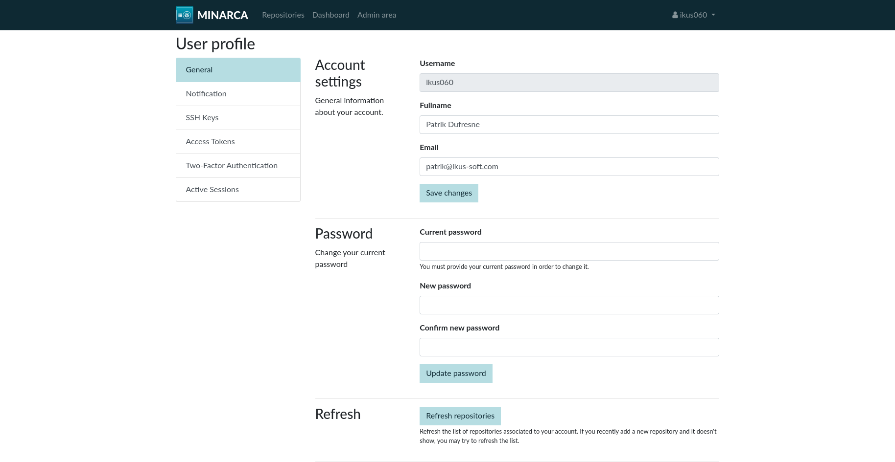

# FAQ

## Is Minarca compatible with…?

The Minarca client works with Windows and Linux
operating systems. We recommend the following configuration:

* Windows 10 and 11
* Debian Linux (recommended)
* Ubuntu Linux
* Other Linux

To access your data on the Minarca Web interface, we recommend the following browsers:

* Google Chrome  (recommended)
* Internet Explorer 9+
* Safari 8+
* Firefox 3+
* Android devices

## How do I install Minarca Client?

### 1. Download

You can download the Minarca client and follow the [**installation procedures**](https://minarca.org/download).

### 2. Configure a backup

Configure a local or online backup destination.

For online backup destination, you need to install Minarca Server.

## How do I change the automatic backup frequency?

To change the automatic backup frequency in Minarca Data Backup software, you can follow these steps:

1. Open the Minarca client on your computer.
2. Look for the **Backup configuration** option within the client's interface and click on it.
3. Click on the backup frequency option to modify it. You may have the choice to select from predefined options such as hourly, daily or bi-daily backups.

Your data will be backed up accordingly at the specified intervals.

## How do I perform a manual backup?

Minarca automatically backs up data according to frequency settings. However, it is possible to manually backup data. To do this, open your Minarca client, and click **Start Backup Now**.

## How do I access my data backups?

To access your data backups, you can open your Minarca client and click the icon in top-right corner to show a side pannel. Then click **Browse**.

## How do I select the folders I would like to back up?

The Minarca client lets you select which folders or files you do or do not want to back up. Open your Minarca client and, in the **File selection** section. You can then choose the folders or files you want to back up.

## There is a folder I would like to back up, but it is not on the list

When you access **File selection**, there is a predefined list of files and folders included. However, it is possible to customize your choice by adding folders. Click **Add folder**, and select one of your existing folders. Follow the same steps to add only one file by clicking **Add file**.

## How do I restore one or more file(s)?

You may restore your data using the Minarca Client or the web interface.

**Restore using Minarca Client**

You can restore your data using the Minarca Client by cliking on **Restore backup**. You will then be prompted to select between a full restore or a custom restore.

**Restore using Web interface**

You can also restore your data from any devices using the web interface. You need to login to the web interface. If you know the URL, simply browser directly to it. Otherwise, you can open your Minarca client and click the icon in top-right corner to show a side pannel. Then click **Browse**.

## How do I link a second device to my account?

With Minarca, you can link several devices to the same account. Simply install the client on your other device, and give each device its own name. When you connect to the web interface, you will have access to all your devices in the **Repository** section.

## How do I delete a backup from one of my devices?

It is possible to completely delete one of your device backups. In the **Repository** section, select the desired device, and then click the **Settings** tab.

**Warning! The deletion of a device backup is permanent!**

## There is a new version of the Minarca client online. How do I get the update?

Simply reinstall the client to get the new version online.

[Download Minarca](https://minarca.org/download)

## How do I change my password?

Change your password in the **User Profile** Top-Right corner in the web interface. For security reasons, we recommend that you choose a secure password. You may also enabled multi-factor authentication for better security.

## I forgot my password. What should I do?

It's not possible for you to recover you password. You must contact your system administrator to recover the password.

## How do I change my email address?

You can change your email address in the **User Profile** Top-Right corner in web interface.

## Can I change my username?

Your username cannot be changed.

## Can I change the names of my repository?

The names of your repository cannot be changed by the user. You must ask a system administrator to rename a repository. To do so, the system administrator could manually rename the folder directly on the server. Any configuration settings such as notification preference defined on the repository will be lost.

## Why are rdiff-backup packages downloaded from custom repository when rdiff-backup is in Debian?

The reason why the rdiff-backup packages are downloaded from our repository instead of using the ones provided by Debian is due to several factors. Firstly, Minarca server is designed to support multiple versions of rdiff-backup for backward compatibility. These versions include 1.2.8, 2.0.x, and soon 2.2.x. However, the packages distributed by Debian cannot be installed side-by-side, which is a requirement for Minarca's functionality.

Moreover, the packages distributed within Minarca are pre-compiled with a specific version of Python that is guaranteed to work in any Debian or Ubuntu distribution, regardless of the Python version provided by the operating system. This ensures compatibility across different environments.

Additionally, there are occasions when we need to apply additional patches to the original source code for compatibility reasons. While most of these patches are eventually merged upstream within a few months, we apply them directly to the packages distributed by Minarca to avoid any disruption for our end-users.

In summary, the rdiff-backup packages distributed by Minarca are specifically tailored and known to work seamlessly with Minarca, whereas the packages provided by Debian may not fulfill these requirements.
