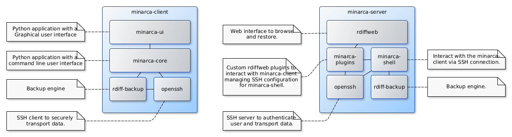

# Introduction

## What is Minarca ?

Minarca is a data backup solution allowing to centralize the management of your backups. This solution has the advantage of being easy to install on a dedicated server and also allows you to easily install an agent called minarca-client on the computers to back up. 

Minarca is a hassle-free backup solution, including all the features you need to better serve your users. The minarca agent is available for all major platforms such as Windows Mac OS and Linux. This allows you to use a single solution to backup your entire computer system.

## Architecture

The Minarca backup solution consists of several components.

First, on the server side, a web application allows you to manage the backups of your users and to configure the access. This web interface also allows you to browse the backup and restore data from your web browser. This component is a modified version of Riffweb.

In addition to this web application, we also install another component called Minarca-shell that takes care of receiving incoming connections via the SSH protocol, validating the authentication and authorization of the user to make a backup, and also isolating each user and their repository.

The last component, named Minarca client, must be installed on the computers to be backed up. This component acts as an agent on the computer and takes care of coordinating the data backup to the Minarca server. Using this agent it is possible to select the files and directories to be backed up and the frequency of the backup.  The Minarca agent can be used via a user interface or command line.

## Main features

* Web interface: browse and restore backup without command lines.
* User management: provides user access control list for repositories.
* User authentication: username and password validation are done using a database or your LDAP server.
* User permission: allows you to control which users can run deletion operations.
* Email notification: emails can be sent to keep you informed when backup fails
* Statistics visualization: web interface to view backup statistics provided by Rdiff-backup.
* Disk Quota: manage disk space allocated to each user.
* Integrated Agent: may be used to quickly backup your data without any technical knowledge
* Compatibility support: allow usability with legacy rdiff-backup v1.2.8 and v2.0.5 agent
* User repository isolation: incoming request are completely isolated from each other
* Automated SSH management: no requirement to manually generate SSH identity, SSH authentication is completely automated and doesn't required intervention
* Open source: no secrets. Minarca is a free open-source software. The source code is licensed under GPL v3.
* Support: business support will be available through [Ikus Software](https://ikus-soft.com).
* Rdiff-backup: used as the main backup software you benefit from its stability, cross-platform. And you can still use it the way you are used to with the command line.

## Software stack

Minarca software consists of 3 components: minarca-server, minarca-shell, minarca-client.

Aside from the web interface, which uses HTML and JavaScript, everything else is written in Python programming language.

## Getting help

### Bug tracker

If you encounter a problem or have a question, you may open a ticket in our issue tracking system.

[Gitlab Issues](https://gitlab.com/ikus-soft/minarca/-/issues)

### Professional support

If you need professional support or custom development, you should contact Ikus Software directly.

[Support Form](https://minarca.org/contactus)
