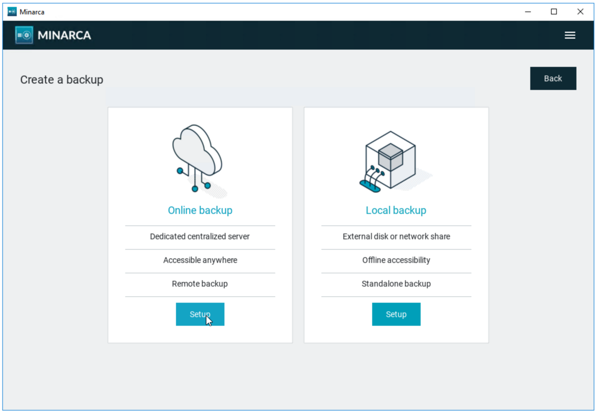
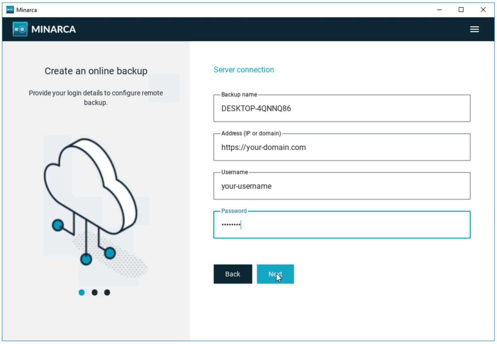
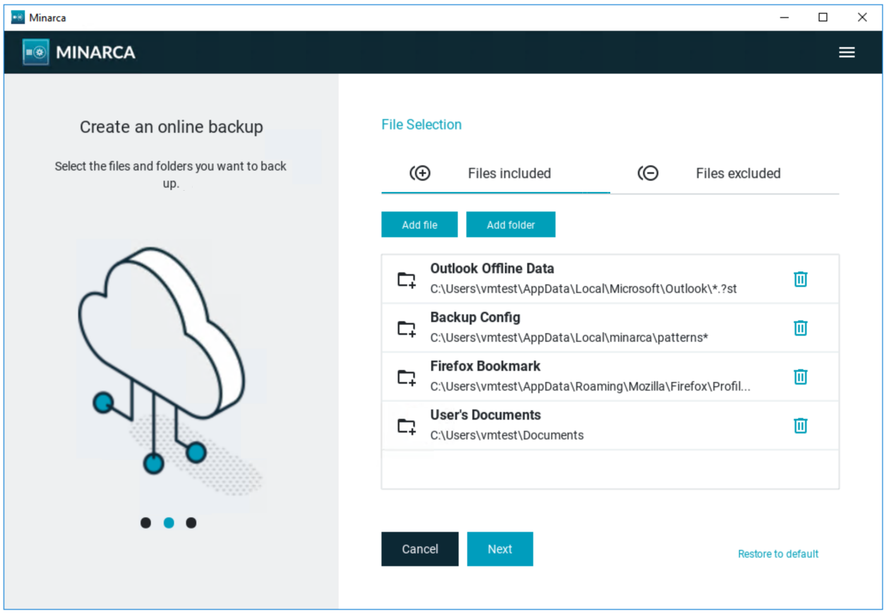
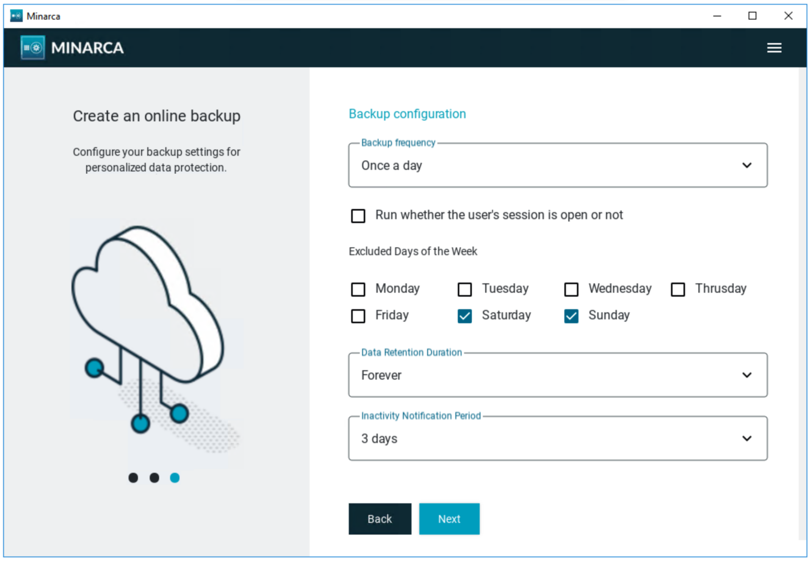

# Client Installation

## System requirements

Minarca client could be installed the following operating system and architectures:

* Supported Operating System:
  * Windows 7 (64bits) - best effort support
  * Windows 10 (64bit)
  * Windows 11 (64 bits)
  * MacOS Catalina (Intel)
  * MacOS BigSur (Intel)
  * Debian Bullseye (64bit)
  * Debian Bookworm (64bit)
  * Debian Trixie (64bit)
  * Ubuntu Jammy 22.04 LTS (64bit)
  * Ubuntu Lunar 23.04 (64bit)
  * Ubuntu Noble 24.04 LTS (64bit)
  * Ubuntu Plucky 25.04 (64bit)
  * Linux (64bit)

## Installation Steps

Installation steps mostly depends on your operating system. Follow the step appropriate for your system.

## Installation on Debian (or Ubuntu)

To install Minarca Client on a Debian or Ubuntu workstation, download the latest installer:

<a href="https://ikus-soft.com/archive/minarca/minarca-client-latest.deb">
  
</a>

Use `apt` to install the package:

```
sudo apt install ./minarca-client-latest.deb
```

For a headless installation (without unnecessary graphical dependencies), install it without recommended packages:

```
sudo apt install --no-install-recommends ./minarca-client-latest.deb
```

Once installed, a shortcut to Minarca should appear in your desktop environment's application menu or on your desktop. Use it to launch and configure Minarca.

## Installation on Linux

For other Linux distribution, you may download a portable package.

<a href="https://www.ikus-soft.com/archive/minarca/minarca-client-latest.tar.gz"></a>

Extract it's content to a folder and launch `minarcaw` executable or `minarca` from command line.

You may need to install additional dependencies manually like `openssh-client`, `zenity` or `kdialogs`.

## Installation on Windows

On a Windows workstation, download the appropriate installer.

<a href="https://www.ikus-soft.com/archive/minarca/minarca-client-latest.exe"></a>

Then launch the execution of the installer and follow the instructions.

**Windows7**: Your installation must be up-to-date or manually install [VC 2015 Redistributable](https://www.microsoft.com/en-US/download/details.aspx?id=48145).

## Installation on MacOS

On a MacOS workstation, download the appropriate installer.

<a href="https://www.ikus-soft.com/archive/minarca/minarca-client-latest.dmg"></a>

Open the disk image and drag-n-drop Minarca to your Applications folder.


Then open Minarca Application !

If you get the following, go in your MacOS **System Settings** --> **Privacy & Security Page** --> **Scroll Down to bottom** --> Click **Open Anyway**. 


[Fix 'Apple could not verify app is free of malware' Mac error - bypass Gatekeeper macOS Sequoia](https://www.youtube.com/watch?v=biIvAM94b98) 


## Configure the Minarca Backup Client
Here’s a clearer, step‑by‑step version you can drop into your docs.

Title: Configure the Minarca Backup Client

**Prerequisites:**

- You must have access to a running Minarca Server.
- For testing only, you can use: https://test.minarca.net

**Option A — Configure from the command line**

Run the configure command with your server details:

```bash
minarca configure -r REMOTE_URL -u USERNAME [-p PASSWORD] -n REPOSITORY_NAME
```

- REMOTE_URL: Your Minarca server URL, for example https://backup.example.com
- USERNAME: Your Minarca account name
- PASSWORD: Optional. If omitted, you’ll be prompted securely
- REPOSITORY_NAME: A friendly name for this computer’s backup (e.g., “Alice‑Laptop”)

**Option B — Configure from the desktop app**

1) Launch Minarca
- Open Minarca from your Start menu or application launcher.
- If the client isn’t linked to a server yet, the Setup wizard opens automatically.

2) Choose Online backup
- Click Setup under Online backup to connect to a Minarca Server.



3) Enter server connection details

- Backup name
  - What it is: A friendly name for this computer’s backup repository.
  - How to choose: Use something you’ll recognize later (e.g., “Alice‑Laptop”, “Finance‑PC‑01”).
  - Tips: Keep it short; avoid special characters like slashes or backslashes.

- Address (IP or domain)
  - What it is: The full URL of your Minarca Server.
  - Format: Include `https://` (for example, https://backup.example.com).
  - For testing: You may use https://test.minarca.net.
  - If your admin provided a path, include it (e.g., https://backup.example.com/minarca).

- Username
  - What it is: Your Minarca account name provided by your administrator (often your email or network username).
  - Enter it exactly as given.

- Password or Access Token 
  - What it is: Your Minarca account password. If Multi‑Factor Authentication (MFA) is enabled on your account, you must use an access token instead of the regular password.
  - If you received a temporary password, change it after your first successful backup.
  - If the Autofill link inserts a password, you can overwrite it before proceeding.



4) Select what to back up
- Files included: Add files or folders you want protected (e.g., Documents, Outlook data, browser profiles).
- Files excluded: Add any paths or patterns you don’t want backed up.
- Click Next to finish. You can adjust selections later.



5) Set backup schedule and policies
- Backup frequency: Choose how often to run backups (e.g., Once a day).
- Run whether the user’s session is open or not: Enable if you want backups even when not logged in.
- Excluded days of the week: Pick days to skip, if any.
- Data retention duration: How long to keep old versions.
- Inactivity notification period: When to alert you if no backups run.
- Click Next. All of these settings can be changed later in Settings.




Notes
- You can revisit all settings at any time from the Minarca client menu.
- If you’re testing, replace your server URL with https://test.minarca.net. For production, always use your own server.


## Silent or Unattended Installation of Minarca Client on Windows

Minarca client can be installed silently on Windows, enabling easy automation and scripted deployments. You can also configure it in unattended mode using the command-line interface (CLI).

**1. Silent Installation**  
  To install Minarca client without user interaction, use the `/S` switch in the installer:
  ```shell
  minarca-client_6.1.2.exe /S
  ```
  This command installs Minarca client in silent mode, with no dialogs or prompts.

**2. Automated Registration and Configuration**  
  After installation, you can register and configure the Minarca client automatically via the CLI. Use the following command to set up the connection to your Minarca server and provide authentication details:

  ```shell
  "C:\Program Files\Minarca\minarca.exe" configure --remoteurl https://example.com --username USERNAME --password CHANGEME
  ```

  Replace `https://example.com`, `USERNAME`, and `CHANGEME` with your actual Minarca server URL, username, and password.

**Additional CLI Options:** Minarca offers more configuration options through its command-line interface. To explore all available CLI commands and options, refer to the official minarca client CLI documentation:  
[Minarca Client CLI Documentation](minarca-client-cli.md)

**Tip:**  
Always ensure your credentials and sensitive information are secured when scripting unattended setups and configuration!

## Customize Minarca Client branding

Minarca lets you tailor a few visual elements and helpful links so the app matches your organization’s look and onboarding flow.

### What you can customize
- Product name shown in shortcut, application title bar and about menu.
- Header logo shown in application navbar
- Favicon show in shortcut and application title bar
- Link and button colors (foreground/background)
- Navigation bar color
- Helpful URLs (download page, default server URL, and the “Where do I find these details?” link in the setup wizard)

### Configuration file
Place a text file named `minarca.cfg` in the same directory as the Minarca executable (that is, next to `minarca.exe` on Windows, or the client binary on other platforms). The file uses simple `key=value` pairs:

```ini
# Display name in the app header
header_name=Your Company Name

# Brand assets (PNG recommended)
header_logo=header_logo.png
favicon=favicon.png

# Colors (hex CSS notation; 6-digit)
link_color=#00ADEE
btn_fg_color=#ffffff
btn_bg_color=#00ADEE
navbar_color=#081E3E

# Helpful links
# Shown on the “Download” entry in about screen
download_url=https://example.com/download/
# Pre-fills the server address field in the setup wizard
remote_url=https://backup.example.com/
# Opens from the “Where do I find these details?” link in the setup wizard
config_help_url=https://example.com/help/
```

Keep the image files (`header_logo.png`, `favicon.png`) in the same folder as `minarca.cfg` and the executable.

### Asset guidelines
- Header logo
  - Format: PNG with transparent background
  - Recommended size: up to 240×32 px (the UI scales down as needed); keep text legible at small sizes
- Favicon
  - Formats: PNG for in‑app use; ICO optional for the Windows installer (see below)
  - Recommended sizes: 1024×1024 px
- Filenames are case‑sensitive on some systems; match the names exactly as written in `minarca.cfg`.

### Color guidelines
- Use standard hex color notation: `#RRGGBB` (e.g., `#081E3E`).
- Ensure sufficient contrast for accessibility:
  - Buttons: `btn_bg_color` vs `btn_fg_color`
  - Links: `link_color` against light/dark backgrounds

### What each setting does
- header_name: Text displayed on the top bar.
- header_logo: Path (relative to the executable folder) to your logo shown in the header.
- favicon: In‑app small icon (e.g., window/taskbar).
- link_color: Color for clickable links in the UI.
- btn_fg_color / btn_bg_color: Button text and background colors.
- navbar_color: Background color of the top navigation bar.
- download_url: Where users are sent to download installers or updates.
- remote_url: Default server URL prefilled in “Address (domain)” during setup.
- config_help_url: Target for the “Where do I find these details?” link; use this to explain username format, tokens for MFA, naming conventions, etc.

### Apply and verify
1) Place `minarca.cfg`, `header_logo.png`, and `favicon.png` next to the Minarca executable.
2) Restart the Minarca client.
3) Verify:
   - Header shows your name and logo
   - Colors update across links, buttons, and navbar
   - Download/help links open your pages
   - The server address field is prefilled with `remote_url`

To revert, remove or rename `minarca.cfg` and restart the app.

## Customize the Windows installer (sidecar files)

You can ship branding alongside the Windows installer so the installed app is branded on first launch. Place the following files in the same folder as the installer before running it:

- setup.cfg       → Will be copied and renamed to `minarca.cfg` in the installation directory
- favicon.ico     → Windows icon for shortcuts
- favicon.png     → Copied for in‑app favicon
- header_logo.png → Copied for in-app header logo

## File Locations

| **Operating System** | **Log File**                          | **Settings Folder**                   | **Status Folder**                     |
|-----------------------|---------------------------------------|----------------------------------------|----------------------------------------|
| **Windows**           | `%LOCALAPPDATA%/minarca/minarca.log` | `%LOCALAPPDATA%/minarca/`             | `%LOCALAPPDATA%/minarca/`             |
| **Linux**             | `$XDG_DATA_HOME/minarca/minarca.log`<br>*(Default: `$HOME/.local/share`)* | `$XDG_CONFIG_HOME/minarca/`<br>*(Default: `$HOME/.config`)* | `$XDG_DATA_HOME/minarca/`<br>*(Default: `$HOME/.local/share`)* |
| **Linux (root)**      | `/var/log/minarca.log`               | `/etc/minarca/`                        | `/var/lib/minarca/`                   |
| **macOS**             | `$HOME/Library/Logs/Minarca/minarca.log` | `$HOME/Library/Preferences/Minarca`   | `$HOME/Library/Minarca`               |


Additional information:
- On **Windows**, `%LOCALAPPDATA%` typically resolves to `%HOME%/AppData/Local`.  
- On **Linux**, `$XDG_DATA_HOME` defaults to `$HOME/.local/share` and `$XDG_CONFIG_HOME` defaults to `$HOME/.config`.  
- On **macOS**, the file paths use standard directories such as `Library/Logs`, `Library/Preferences`, and `Library`.  

On all platforms, it is possible to override the default locations for the settings and status folders using environment variables:

| **Folder**           | **Environment Variable**   | **Description**                          |
|-----------------------|----------------------------|------------------------------------------|
| **Settings Folder**   | `$MINARCA_CONFIG_HOME`     | Sets a custom path for configuration files. |
| **Status Folder**     | `$MINARCA_DATA_HOME`       | Sets a custom path for status files.        |

