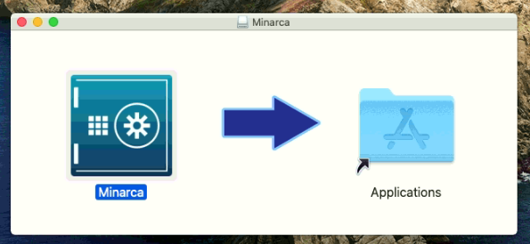
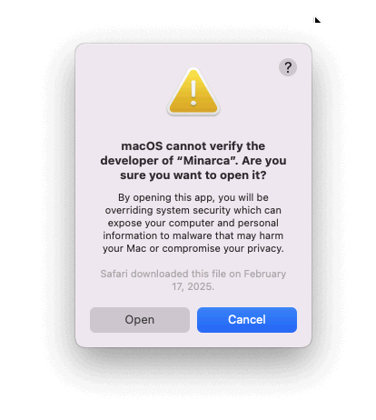

# Client Installation

## System requirements

Minarca client could be installed the following operating system and architectures:

* Supported Operating System:
  * Windows 7 (64bits) - best effort support
  * Windows 10 (64bit)
  * Windows 11 (64 bits)
  * MacOS Catalina (Intel)
  * MacOS BigSur (Intel)
  * Debian Bullseye (64bit)
  * Debian Bookworm (64bit)
  * Debian Trixie (64bit)
  * Ubuntu Jammy 22.04 LTS (64bit)
  * Ubuntu Lunar 23.04 (64bit)
  * Ubuntu Noble 24.04 LTS (64bit)
  * Ubuntu Oracular 24.10 (64bit)
  * Ubuntu Plucky 25.04 (64bit)
  * Linux (64bit)

## Installation Steps

Installation steps mostly depends on your operating system. Follow the step appropriate for your system.

## Installation on Debian (or Ubuntu)

To install Minarca Client on a Debian or Ubuntu workstation, download the latest installer:

<a href="https://ikus-soft.com/archive/minarca/minarca-client-latest.deb">
  
</a>

Use `apt` to install the package:

```
sudo apt install ./minarca-client-latest.deb
```

For a headless installation (without unnecessary graphical dependencies), install it without recommended packages:

```
sudo apt install --no-install-recommends ./minarca-client-latest.deb
```

Once installed, a shortcut to Minarca should appear in your desktop environment's application menu or on your desktop. Use it to launch and configure Minarca.

## Installation on Linux

For other Linux distribution, you may download a portable package.

<a href="https://www.ikus-soft.com/archive/minarca/minarca-client-latest.tar.gz"></a>

Extract it's content to a folder and launch `minarcaw` executable or `minarca` from command line.

You may need to install additional dependencies manually like `openssh-client`, `zenity` or `kdialogs`.

## Installation on Windows

On a Windows workstation, download the appropriate installer.

<a href="https://www.ikus-soft.com/archive/minarca/minarca-client-latest.exe"></a>

Then launch the execution of the installer and follow the instructions.

**Windows7**: Your installation must be up-to-date or manually install [VC 2015 Redistributable](https://www.microsoft.com/en-US/download/details.aspx?id=48145).

## Installation on MacOS

On a MacOS workstation, download the appropriate installer.

<a href="https://www.ikus-soft.com/archive/minarca/minarca-client-latest.dmg"></a>

Open the disk image and drag-n-drop Minarca to your Applications folder.



Then open Minarca Application !

If you get the following, go in your MacOS **System Settings** --> **Privacy & Security Page** --> **Scroll Down to bottom** --> Click **Open Anyway**. 



[Fix 'Apple could not verify app is free of malware' Mac error - bypass Gatekeeper macOS Sequoia](https://www.youtube.com/watch?v=biIvAM94b98) 


## Link your client with Minarca Server

Pre-requisite: You need to have a functional Mianrca Server deployed. You may use <https://test.minarca.net> which is made available for testing purpose.

**From User Interface:**

1. Simply open `minarcaw`. If you have installed Minarca client you should be able to launch the client from your start menu.
2. If Minarca is not yet linked to a server, a Setup dialog will be shown to allow you to configure Minarca with you server.
3. You must provide the URL to you Minarca server, a username and password.
4. You must also provide a repository name.

**From Command line:**

    minarca configure -r REMOTEURL -u USERNAME [-p PASSWORD] -n NAME

### File Locations

| **Operating System** | **Log File**                          | **Settings Folder**                   | **Status Folder**                     |
|-----------------------|---------------------------------------|----------------------------------------|----------------------------------------|
| **Windows**           | `%LOCALAPPDATA%/minarca/minarca.log` | `%LOCALAPPDATA%/minarca/`             | `%LOCALAPPDATA%/minarca/`             |
| **Linux**             | `$XDG_DATA_HOME/minarca/minarca.log`<br>*(Default: `$HOME/.local/share`)* | `$XDG_CONFIG_HOME/minarca/`<br>*(Default: `$HOME/.config`)* | `$XDG_DATA_HOME/minarca/`<br>*(Default: `$HOME/.local/share`)* |
| **Linux (root)**      | `/var/log/minarca.log`               | `/etc/minarca/`                        | `/var/lib/minarca/`                   |
| **macOS**             | `$HOME/Library/Logs/Minarca/minarca.log` | `$HOME/Library/Preferences/Minarca`   | `$HOME/Library/Minarca`               |


Additional information:
- On **Windows**, `%LOCALAPPDATA%` typically resolves to `%HOME%/AppData/Local`.  
- On **Linux**, `$XDG_DATA_HOME` defaults to `$HOME/.local/share` and `$XDG_CONFIG_HOME` defaults to `$HOME/.config`.  
- On **macOS**, the file paths use standard directories such as `Library/Logs`, `Library/Preferences`, and `Library`.  

On all platforms, it is possible to override the default locations for the settings and status folders using environment variables:

| **Folder**           | **Environment Variable**   | **Description**                          |
|-----------------------|----------------------------|------------------------------------------|
| **Settings Folder**   | `$MINARCA_CONFIG_HOME`     | Sets a custom path for configuration files. |
| **Status Folder**     | `$MINARCA_DATA_HOME`       | Sets a custom path for status files.        |
