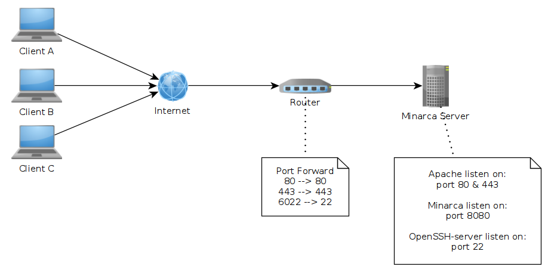

# Deploy Minarca Behind a Router with a Reverse Proxy

This documentation explains how to configure Minarca Server behind a reverse proxy with SSL.
An Apache or Nginx server will act as a gateway for requests to Minarca, and SSL will provide additional security.

The following diagram illustrates how clients connect to the Minarca server behind a router and a reverse proxy:



## Prerequisites

1. **Configure a domain name**: You need a domain name configured via DNS or DDNS. The details of DNS configuration are out of scope for this documentation.
2. **Router Port Forwarding**: Configure your router to forward ports 80, 443, and 6022 to ports 80, 443, and 22 on your Minarca server. The specifics of router configuration vary by model and are out of scope for this documentation.
3. **Install and Configure a Reverse Proxy**: Set up a reverse proxy on the same server running `minarca-server`. You can use Apache, Nginx, or another HTTP proxy.
4. **Configure Let's Encrypt Certificate with Certbot**: Secure your domain with an SSL certificate.

## Configure a Domain Name

To deploy Minarca behind a router with a reverse proxy, it is recommended to use a dedicated domain name (e.g., `backups.example.com`). Clients will use this domain name to configure their backup settings and access the web interface at `https://backups.example.com`.

Check with your domain registrar for DNS configuration details. If your ISP does not provide a static IP address, you will need to configure DDNS to update the DNS entry dynamically when your router or modem receives a new IP address.

## Configure Router Port Forwarding

You need to configure your router to forward three ports:
- **Port 80 (HTTP)**
- **Port 443 (HTTPS)**
- **Port 6022 (SSH for Minarca remote access)**

Refer to your router's documentation or online resources for instructions on setting up port forwarding.

## Configure Apache Reverse Proxy with SSL (Let's Encrypt)

While Minarca Server supports SSL, it is recommended to use a robust HTTP server like Apache for SSL termination. Apache offers better performance, flexibility, and security than Minarca's built-in Python implementation.

[Reference: How to configure letencrypt](https://wiki.debian.org/LetsEncrypt)

### Install Apache and Required Modules

```sh
sudo apt-get install apache2 python3-certbot-apache
sudo a2enmod rewrite proxy proxy_http ssl headers
```

### Obtain an SSL Certificate with Certbot

```sh
sudo certbot certonly --preferred-challenges http --expand -d backups.example.com
```

Follow the on-screen instructions to provide your email address, agree to the terms of service, and obtain the SSL certificate.

### Configure Apache Virtual Hosts

Edit your Apache configuration file (e.g., `/etc/apache2/sites-available/minarca.conf`) and add the following:

```apache
<VirtualHost *:80>
    ServerName backups.example.com
    ServerAdmin admin@example.com
    RewriteEngine on
    RewriteRule ^(.*)$ https://backups.example.com$1 [L,R=301]
</VirtualHost>

<VirtualHost *:443>
    ServerName backups.example.com
    ServerAdmin admin@example.com
    
    ProxyRequests Off
    ProxyPreserveHost On
    ProxyPass / http://localhost:8080/ connectiontimeout=5 keepalive=on
    ProxyPassReverse / http://localhost:8080/
    RequestHeader set X-Forwarded-Proto https
    RequestHeader set X-Real-IP %{REMOTE_ADDR}s
    
    SSLEngine on
    SSLCertificateFile    /etc/letsencrypt/live/backups.example.com/cert.pem
    SSLCertificateKeyFile /etc/letsencrypt/live/backups.example.com/privkey.pem
    SSLCertificateChainFile /etc/letsencrypt/live/backups.example.com/fullchain.pem
    <Location />
        Order Allow,deny
        Allow from all
    </Location>
</VirtualHost>
```

Enable the site and restart Apache:

```sh
sudo a2ensite minarca.conf
sudo systemctl reload apache2
```

## Configure Minarca Server for Reverse Proxy

When deploying Minarca Server behind a router and a reverse proxy, you need to adjust its configuration:

- Restrict the Minarca web interface to listen only on localhost:
  ```ini
  server-host=127.0.0.1
  ```
- Define the external URL for email notifications and web interface redirections:
  ```ini
  external-url=https://backups.example.com/
  ```
- Set the SSH remote host and port:
  ```ini
  minarca-remote-host=backups.example.com:6022
  ```

Edit `/etc/minarca/minarca-server.conf` and add the above lines. Then restart the Minarca service:

```sh
sudo systemctl restart minarca-server
```

## Configure Nginx Reverse Proxy

If you prefer Nginx over Apache, you can use the following configuration as a reference.

### Install Nginx and Certbot

```sh
sudo apt-get install nginx python3-certbot-nginx
sudo certbot --nginx -d backups.example.com
```

### Nginx Reverse Proxy Configuration

Edit `/etc/nginx/sites-available/minarca` and add:

```nginx
server {
    listen 80;
    server_name backups.example.com;
    return 301 https://$host$request_uri;
}

server {
    listen 443 ssl;
    server_name backups.example.com;

    ssl_certificate /etc/letsencrypt/live/backups.example.com/fullchain.pem;
    ssl_certificate_key /etc/letsencrypt/live/backups.example.com/privkey.pem;

    location / {
        proxy_set_header Host $host;
        proxy_set_header X-Real-IP $remote_addr;
        proxy_set_header X-Forwarded-For $proxy_add_x_forwarded_for;
        proxy_set_header X-Forwarded-Host $server_name;
        proxy_set_header X-Forwarded-Proto $scheme;
        proxy_pass http://127.0.0.1:8080/;
    }
}
```

Enable the configuration and restart Nginx:

```sh
sudo ln -s /etc/nginx/sites-available/minarca /etc/nginx/sites-enabled/
sudo systemctl reload nginx
```

## Final Notes

- Always ensure your firewall allows traffic on ports 80, 443, and 6022.
- Regularly renew your SSL certificates using Certbot's auto-renewal feature (`certbot renew`).
- Check your logs (`/var/log/apache2/error.log` or `/var/log/nginx/error.log`) if you encounter issues.

This setup ensures that Minarca is securely accessible via HTTPS and properly configured behind a router and a reverse proxy.
