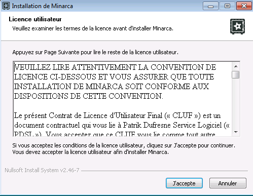
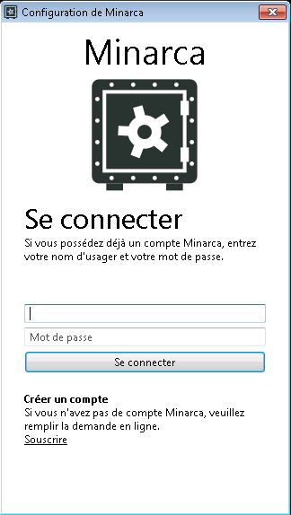
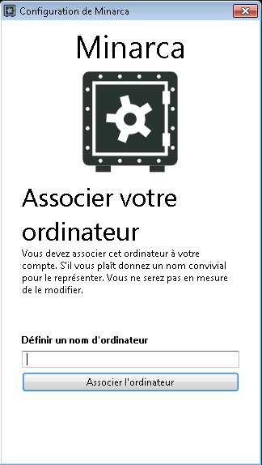
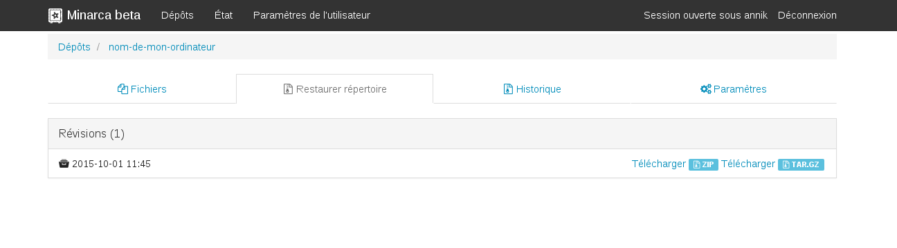
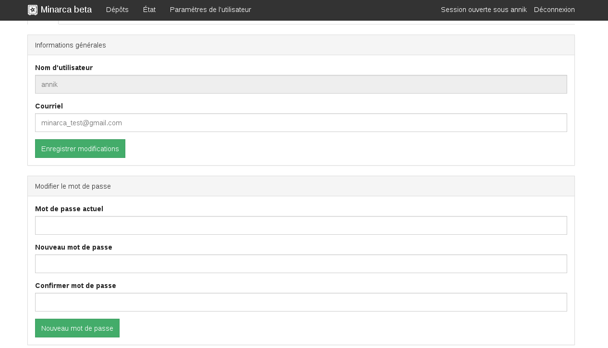

# FAQ

## Is Minarca compatible with…?

The Minarca client application works with Windows and Linux
operating systems. We recommend the following configuration:

* Windows 7, 8 or 10
* Debian Linux Buster (recommended)
* Other Linux

To access your data on the Minarca Web interface, we recommend the following browsers:

* Google Chrome  (recommended)
* Internet Explorer 9+
* Safari 8+
* Firefox 3+
* Android devices

## What is Minarca.net SaaS ?

[Minarca.net SaaS](https://www.minarca.net) (Software as a service) allows you to backup your data using Minarca without the trouble of installing Minarca Server. This solution is perfect to Small Business or non-technical customer. You will benefits from Minarca without the burden of maintaining the hardware architecture.

## How do I sign up for Minarca.net SaaS ?

You may subscribe to our [Minarca.net SaaS](https://www.minarca.net) (Software as a service) which allow you to benefit from Minarca without installing a server. To subscribe, you may fill the [subscription form](https://www.ikus-soft.com/en/support/#form) or send an email to [support@ikus-soft.com](mailto:support@ikus-soft.com). We will contact you to finalize your subscription, either by email or phone, depending on your preference.

## How do I install Minarca Client?

### 1. Download

You can download the Minarca application and follow the [**installation procedures**](https://ikus-soft.com/en/minarca/download/).

### 2. Subscribe

Enter the username and temporary password assigned to you, and then create a name to link your computer to Minarca.

**Warning!** The name of your device cannot be changed.

### 3. Enjoy Minarca

 Once the application is installed, you can access the Minarca web interface either at [**https://www.minarca.net**](https://www.minarca.net/) or by clicking on the **Go to the Minarca Web Site ** icon in your application itself. You will have to sign in again.

## How do I change the automatic backup frequency?

By default, Minarca backs up data once a day. However, you can change the frequency (hourly, daily, weekly or monthly). To change backup frequency, open the Minarca application in the **Backup Settings** section, and choose the desired schedule.

## How do I perform a manual backup?

Minarca automatically backs up data according to frequency settings. However, it is possible to manually backup data. To do this, open your Minarca application, and go to **Backup Settings**. Click **Start**.

## How do I access my data backups?

To access your data backups, you can open your Minarca application and click the icon in the **Your Data** section.

## How do I select the folders I would like to back up?

The Minarca application lets you select which folders or files you do or do not want to back up. Open your Minarca application and, in the **Backup Settings** section, click on the **Selective Backup** icon. You can then choose the folders or files you want to back up.

## There is a folder I would like to back up, but it is not on the list.

When you access **Selective Backup**, there is a predefined list of files. However, it is possible to customize your choice by adding folders. Click **Add Folder**, and select one of your existing folders. Follow the same steps to add only one file by clicking **Add File**.

## How do I restore one or more file(s)?

You can restore a complete backup or specific files only by accessing your data at [**https://www.minarca.net**](https://www.minarca.net/). In the **Repository** section, choose the device you would like to back up.

**For a complete backup:** select the **Restore Directory** tab, and download the desired version of the backup.

**To restore a directory:** stay in the **Browse Directory** tab, and select the file you want to restore. Once the file has been selected, go to the **Restore Directory** tab, and download. Only the selected file will be downloaded.

## How do I link a second device to my account?

With Minarca, you can link several devices to the same account. Simply install the application on your selected devices, and give each device its own name. When you connect with [**Minarca**](https://www.minarca.net/), you will have access to all your devices in the **Repository** section.

## How do I delete a backup from one of my devices?

It is possible to completely delete one of your device backups. In the **Repository** section, select the desired device, and then click the **Settings** tab.

**Warning! The deletion of a device backup is permanent!**

## There is a new version of the Minarca application online. How do I get the update?

Simply reinstall the application to get the new version online.

## How do I change my password?

Change your password in the *User Profile* (Top-Right corner in the web application). For security reasons, we recommend that you choose a secure password:

* with at least 8 characters
* containing letters (a-z) and numbers (0-9)

## I forgot my password. What should I do?

It's not possible for you to recover you password. You must contact your systeme administrator to recover the password.

## How do I change my email address?

You can change your email address in the *User Profile* (Top-Right corner in web application).

## Can I change my username?

Your username cannot be changed.

## Can I change the names of my repository?

The names of your repository cannot be changed by the user. You must ask a system administrator to rename a repository.

## How much space do my backups use?

As soon as you connect to the Minarca web interface, you can see the space used and the space available in the **Repository** section. The total space should match your plan.

## Why are the names of my files in French in my data backup?

Even though the folders are in English on your device, they may be backed up with French names. This has to do with your operating system. The problem is most common with Windows 7 and up.

## Why is my Minarca application installed in French?

If your operating system is in French, Minarca will be installed in French.

## I backed up a device, and it does not appear in the "Repository" section

If you back up a device for the first time and it does not appear in the **Repository** section, you can refresh your repository in [**User profile**](https://www.minarca.net/prefs/) by clicking **Refresh Repository** at the bottom of the page.

## I cannot link my computer when installing Minarca

While linking your computer to Minarca, you see the message **An unknown error has occurred! If the problem persists, try reinstalling Minarca**. If the problem still persists, contact us online by filling out the [**Help Form**](https://www.ikus-soft.com/en/support/#form).

## Why is my backup not running ?

For security measure, Minarca client on Windows is configured to only start when you have an open session. If you are not logged in to the computer, Minarca is not running the backup.

To overcome this limitation, you may manually change the configuration of the scheduler to run when you are not logged in. To do this:

1. Go to Start Menu
2. Search for "Task Scheduler"
3. Select "Minarca backup" task
4. Select "Run Whether user is logged on or not"

